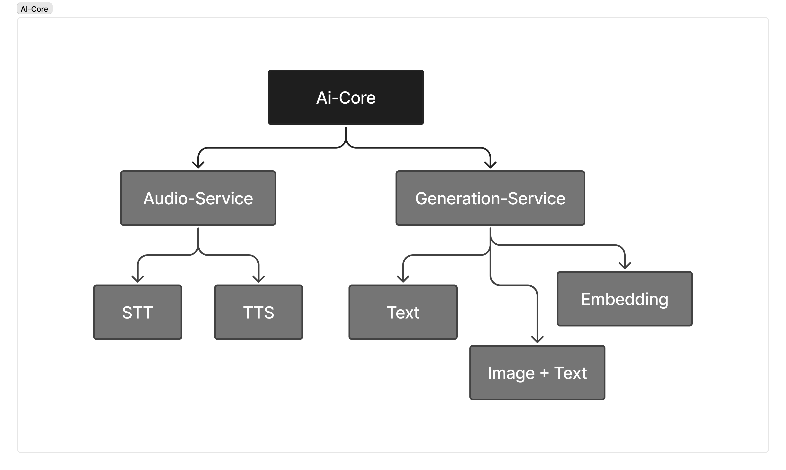

## 📦 `ai-core` – Android AI Core Library (AAR)


# ai-core (Android Java/Kotlin AAR)

> **ai-core** exposes a powerful, lightweight LLM stack (text‑generation, embeddings, multimodal vision) via a single self‑contained **AAR**.  
> The binary contains the JNI glue + a native `ai_core.so` built with **llama.cpp** and **mtmd** (multimodal) back‑end.


## ✅ Features

 

| Feature | Supported |
|---------|-----------|
| **Text‑generation** | ✅ single‑threaded inference (CPU) via **NativeLib** |
| **Text‑embeddings** | ✅ `EmbedLib` – returns a `FloatArray` embedding vector |
| **Multimodal vision** | ✅ `MtmdLib` – image + text streaming generation |
| **Streaming callbacks** | ✅ `IGenerationCallback` (token, tool‑call, error, done) |
| **State persistence** | ✅ KV‑cache save / load |
| **Speech‑to‑text (STT)** | ✅ Sherpa‑ONNX AIDL service |
| **Text‑to‑speech (TTS)** | ✅ Sherpa‑ONNX TTS flow & API |
| **Model swapping** | ✅ `ModelSwapper` ensures only one native instance at a time |
| **Configurable prompt / template** | ✅ system prompt, chat template, tools JSON |
| **Debug & diagnostics** | ✅ `llamaPrintTimings`, `modelInfo` JSON |
| **Background threads** | ✅ Coroutines + `Dispatcher.IO/Default` for all heavy work |

> ⚠️ Currently **GPU support is disabled** (CPU‑only). Feel free to enable `MIGraphX` or `Metal` in `ai_core.cpp` if needed.

---

## 💻 Getting Started

### 1️⃣ Add the AAR to your project

```text
app/
 ├─ libs/
 │   ├─ ai_core-1.0.0.aar   # provided in `build-output/`
 └─ build.gradle
```

```gradle
// app/build.gradle
dependencies {
    implementation(fileTree(dir: 'libs', include: ['*.aar']))
}
```

> **Important**:  
> *Add the NDK path in `local.properties`*  
> `ndk.dir=/path/to/ndk`

### 2️⃣ Declare PROPER permissions

```xml
<uses-permission android:name="android.permission.MANAGE_EXTERNAL_STORAGE" />
<uses-permission android:name="android.permission.FOREGROUND_SERVICE" />
<uses-permission android:name="android.permission.POST_NOTIFICATIONS" />
```

### 3️⃣ Generic Usage

```kotlin
val lib = NativeLib.getInstance()
val ok = lib.init(
    path = "/sdcard/models/llama-2-7B.gguf",
    threads = 4,
    ctxSize = 4096,
    temp = 0.7f,
    topK = 20,
    topP = 0.9f,
    minP = 0.0f
)

if (ok) {
    lib.generateStreaming(
        prompt = "Hello AI!",
        maxTokens = 128,
        callback = object : IGenerationCallback { ... }
    )
}
```

**Embedding**:

```kotlin
val embed = EmbedLib.getInstance()
val vec: FloatArray? = embed.encode("some text")
```

**Multimodal**:

```kotlin
MtmdLib.getInstance().init("mmproj.bin", threads = 4)
val imgBytes = /* load PNG/JPEG */
MtmdLib.getInstance().nativeGenerateStreamWithImage(
    prompt = "Describe image",
    imageData = imgBytes,
    imageWidth = 640,
    imageHeight = 480,
    maxTokens = 256,
    callback = object : StreamCallback { ... }
)
```

### 4️⃣ Clean‑up

```kotlin
NativeLib.releaseAll()
EmbedLib.release()
MtmdLib.releaseInstance()
```

---

## 🔧 Build Script (`scripts/build_llama.sh`)

```text
sh scripts/build_llama.sh /path/to/llama.cpp
```

* Builds **libllama.so**, **libggml.so**, **libggml-cpu.so**, **libggml-base.so**, and **libmtmd.so** for `arm64-v8a` and `x86_64`.
* Output goes to `build-output/<abi>/bin/`.
* Requires `ANDROID_NDK` env‑var to be set.

---

### Helper Sub‑packages

| Path | Purpose |
|------|---------|
| `chat/...` | Prompt / chat template rendering (`chat_template.cpp`). |
| `cpu/...` | CPU helper utilities; `cpu_helper.cpp` furnishes thread counters. |
| `global_state/...` | Singleton context (`g_state`) holding the LLM model / tokenizer. |
| `state/...` | `ModelState` implementation, tokenisation, detokenisation, cache. |
| `tool_calling/...` | Ragged tool‑call parser (`tool_call_state.cpp`). |
| `utils/...` | `jni_utils.cpp` (callbacks), `logger.h`, `utf8_utils.cpp` (UTF‑8 conversions). |

---

## 🔄 Project Overview (App Module)

```text
app/
 ├─ src/main/AndroidManifest.xml
 ├─ src/main/java/com/mp/ai_core/MainActivity.kt
 ├─ src/main/java/com/mp/ai_core/text/GenerationService.kt
 ├─ src/main/java/com/mp/ai_core/ModelSwapper.kt
 ├─ src/main/java/com/mp/ai_core/stt/   (Sherpa STT)
 ├─ src/main/java/com/mp/ai_core/tts/   (Sherpa TTS)
 └─ build.gradle
```

**Functionality**
- Demonstrates how to bind the `GenerationService` (foreground service) and call LLM APIs from UI.
- Shows embedding, GET CHUNK generation, multi‑modal, STT / TTS usage.
- Uses `ViewModel + Compose` for UI; all heavy work is on `Dispatchers.IO`.

**Build**
```gradle
implementation(fileTree(dir: 'libs', include: ['*.aar']))
```

---

## 🗣️ Speech‑to‑Text (STT)

```text
app/src/main/java/com/mp/ai_core/stt/
 ├─ SherpaSTTManager.kt   (Singleton manager)
 ├─ SherpaSTTService.kt   (AIDL service, runs in :stt process)
 └─ SherpaSTTClient.kt    (Client wrapper)
```

### Key Points
- Uses **Sherpa‑ONNX** (offline) for fast voice recognition.
- Exposes a **remote AIDL service** (`ISherpaSTTService`) – preferable for memory‑heavy models.
- Clients bind to the service via `SherpaSTTClient`.
- Thread‑safe init, transcribe file/samples, release.

---

## 🔊 Text‑to‑Speech (TTS)

```text
app/src/main/java/com/mp/ai_core/tts/
 ├─ ITtsService.kt
 ├─ TtsEngine.kt          (Sherpa‑ONNX implementation)
 ├─ TtsServiceFactory.kt
 └─ (AIDL service optional)
```

### Features
- `ITtsService` contract: `initialize`, `generateAudioStream`, `stop`, `release`.
- TTS samples streamed as `Flow<AudioChunk>`.
- Thread‑safe hot‑reinitialization.

---

## 📦 How to Release / Distribute

1. **Compile** via `gradlew assembleRelease`.
2. Take `ai_core-1.0.0.aar` from `build/libs`.
3. Include `libs/` folder in your Android project or host on JCenter/GitHub Packages.
4. Add `implementation(fileTree(dir: 'libs', include: ['*.aar']))`.

---

## 📄 Full List of Public APIs (`ai-core` AAR)

```kotlin
// Text generation
NativeLib.init(...)
NativeLib.generateStreaming(...)

// Embedding
EmbedLib.getInstance().encode(...)

// Multimodal
MtmdLib.getInstance().init(...)
MtmdLib.getInstance().nativeGenerateStreamWithImage(...)

// STT (via AIDL)
SherpaSTTClient(...)

// TTS (via ITtsService)
TtsServiceFactory.createTtsService()
```

All public methods are `suspend` where necessary or return `Callback` interfaces.

---

## 📂 Folder Tree Recap

```
ai-core/
 ├─ src/main/cpp/src/
 │   ├─ chat/
 │   ├─ cpu/
 │   ├─ global_state/
 │   ├─ state/
 │   ├─ tool_calling/
 │   └─ utils/
 ├─ src/main/java/com/mp/ai_core/
 │   ├─ text/
 │   ├─ stt/
 │   ├─ tts/
 │   └─ helpers/
 ├─ CMakeLists.txt
 ├─ build_llama.sh
 └─ README.md
```

> ⭐️ **Happy coding** – the library is designed to be *plug‑and‑play*.  Use the README as your “starter kit”.

---